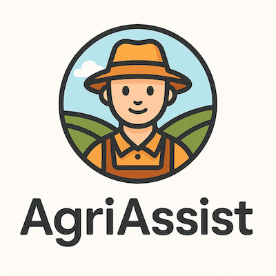

🌾 AgriAssist: AI-Powered Agricultural Advisor

🧭 Project Overview
AgriAssist is an intelligent assistant designed to support small-scale farmers in underdeveloped regions by providing accurate, localized answers to crop-related questions. It leverages parameter-efficient fine-tuning (PEFT) and retrieval-augmented generation (RAG) to deliver reliable agricultural insights using local documents and weather data.

🎯 Goals
Empower farmers with AI-driven advice on crop care, pest control, soil health, and seasonal planning.
Reduce crop loss and improve yield through accessible, context-aware information.
Support low-literacy users with voice-based interaction.

🧠 Technologies Used

PEFT (LoRA, QLoRA): Efficient fine-tuning of small language models on agricultural extension documents.
RAG: Retrieval of relevant information from soil guides, crop calendars, and pest control manuals.
Vector Search: FAISS or ChromaDB for document chunk retrieval.
UI: Streamlit or Gradio for user-friendly interaction.
Voice I/O: Optional integration with speech-to-text and text-to-speech APIs.

🌍 Social Impact
AgriAssist is designed to be deployable on low-resource devices and usable offline, making it ideal for rural areas with limited internet access. It aims to democratize agricultural knowledge and improve food security.

📢 Future Enhancements

Multilingual support for local dialects.
Integration with real-time weather APIs.
Mobile app version with offline capabilities.
Community feedback loop for continuous improvement.

## 🚀 Installation
1. Clone the repository:
   ```bash
   git clone https://github.com/padeirocarlos/croagriassist-response-ai.git
   curl -fsSL https://ollama.com/install.sh | sh
   ollama server
   ollama pull ollama3  # pull one of this model:  gemma4B_v gemma12B_v qwen3 gemini ollama3.2 deepseek
   cd agriassist-response-ai
   uv sync
   uv add -r requirements.txt
   uv run main.py